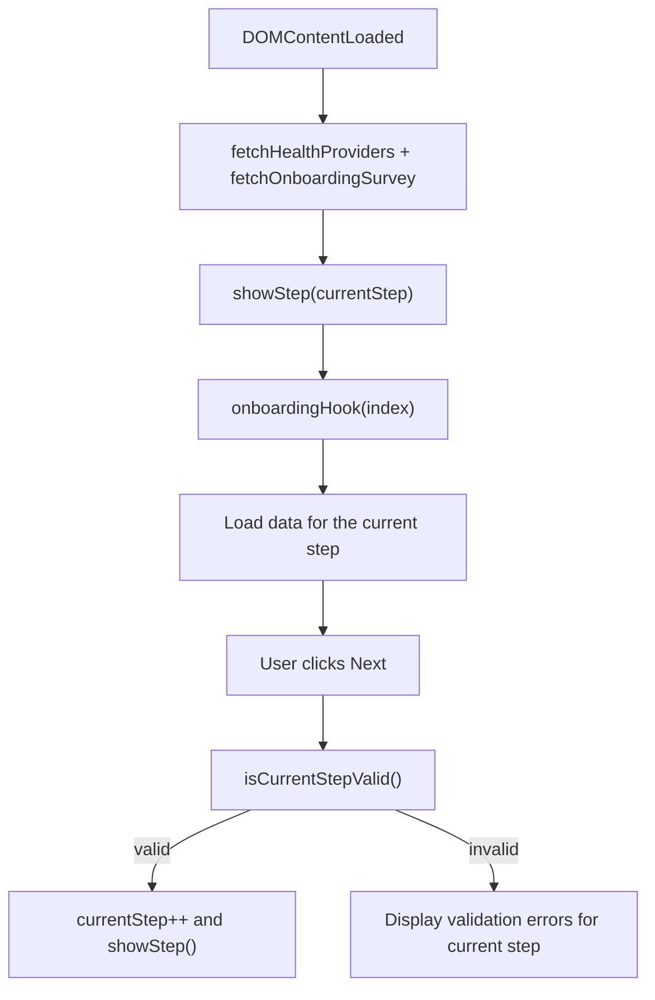

# Onboarding Flow

## Steps

- `Step 0` - health provider selection, KVNR validation (if the field is shown).
- `Step 1` - first survey block (up to 2 options).
- `Step 2` - second survey block (at least 1 option).
- `Step 3` - course recommendations and program selection.
- `Step 4` - contraindications + consent popup.
- `Step 5` - registration form and checkout.

## Runtime flow

## Recommendation Logic

- Step 1 and Step 2 answers are saved to `onboardingSurveyAnswers_1/2`.
- A frequency map is built by answer types (`SurveyAnswersCourseTypes`).
- Top-2 types are selected and mapped to courses.
- `recommendedCourses` is immediately copied to `selectedCourses` (can be changed on the summary step).

## Important UI Rules

- On provider change, `health-provider-updated` is dispatched.
- `applyHealthProviderVisibilityRules()` sets classes on `body`:
  - `is-provider-not-in-list`;
  - `is-provider-partner`.
- These classes control section visibility in Webflow.
