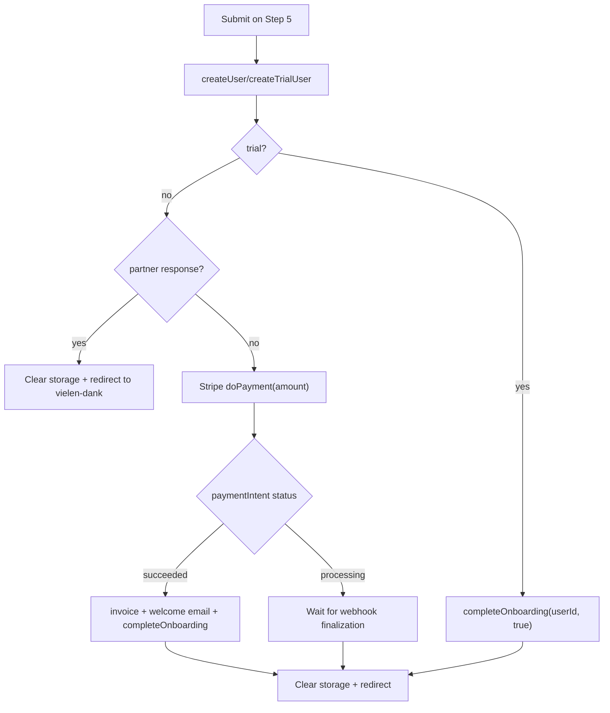
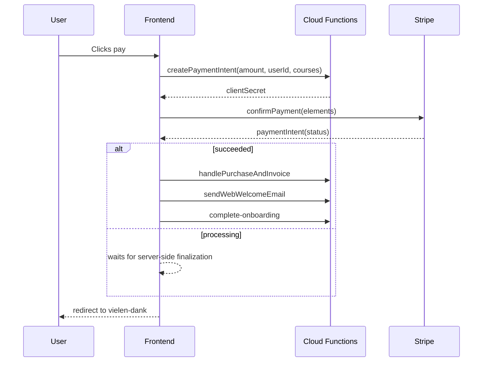

# Payment & Trial Flow

## Branches After Form Submit

## Stripe Scenario

## Error Handling and Safeguards

- Payment errors are shown in `#error_message_payment`.
- The submit button is switched to loading state and disabled.
- After success, key data is cleared (`clearLocalStorageAfterPayment()`) to prevent reuse of stale state.
