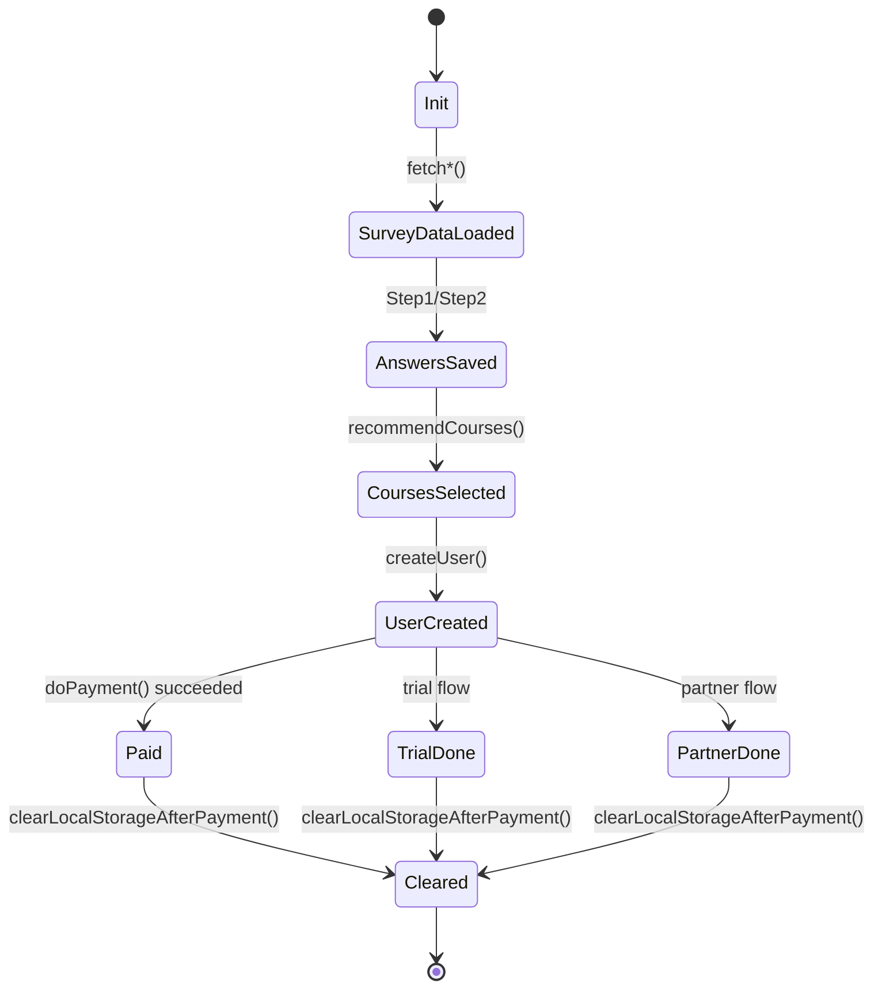

# State & localStorage

## Why Storage Is Used

State is persisted in `localStorage` between steps and page reloads.  
In this project, the DOM is a view layer, not the source of truth.

## Key Data Groups

- Navigation: `currentStep`.
- Profile and form: `userData`, `userId`, `createUserPayload`, `createUserResponse`.
- Survey and recommendations: `onboardingSurvey`, `onboardingSurveyAnswers_1`, `onboardingSurveyAnswers_2`, `recommendedCourses`, `selectedCourses`.
- Health providers: `selectedHealthProvider`, `healthProviders`, `healthInsurancePartners`, `isSelectedProviderPartner`, `healthInsuranceNumber`.
- Commerce: `pricing`, `trial`, `paymentIntentPayload`, `paymentIntentResponse`, `paymentSuccess`, `invoiceUrl`.

## State Lifecycle

## Practical Notes

- Password must not be stored in storage; the form module removes it from `userData`.
- KVNR includes legacy key migration: `"health insurance number"` -> `"healthInsuranceNumber"`.
- For debugging, inspect storage after each step, not only at the end of submit flow.
